# ML Systems Lab

Small implementations and experiments for understanding machine learning and reinforcement learning systems from first principles.

The current modules compare exploration strategies for stochastic multi-armed bandits, tabular control methods, DQN, REINFORCE, and PPO on small environments.

## At A Glance

| Module | What it demonstrates |
| --- | --- |
| Bandits | Exploration strategies, regret, repeated simulations |
| Tabular RL | Bellman updates, Q-learning, SARSA |
| DQN | Replay buffer, target network, neural Q-values |
| REINFORCE | Episode returns, stochastic policies, policy gradients |
| PPO | Actor-critic learning, advantages, clipped policy updates |

The aggregate result summary is in [results/summary.md](results/summary.md). A short interview checklist is in [docs/interview_guide.md](docs/interview_guide.md).

## Multi-Armed Bandits

A Bernoulli bandit has several arms, each with an unknown probability of returning reward `1`. The agent chooses one arm per step and tries to learn which arm has the highest expected reward.

The environment used here has five arms:

```text
[0.10, 0.35, 0.60, 0.45, 0.80]
```

The agent does not observe these probabilities directly. They are used by the environment to sample rewards and by the experiment code to calculate expected regret.

## Algorithms

| Algorithm | Main idea |
| --- | --- |
| Random | Choose arms uniformly at random as a sanity baseline. |
| Epsilon-greedy | Mostly choose the best estimated arm, sometimes explore randomly. |
| Optimistic initial values | Start value estimates high so early greedy choices try different arms. |
| UCB1 | Add an uncertainty bonus to arms with fewer samples. |
| Thompson Sampling | Sample each arm's success probability from a Beta posterior. |

## Experiments

Default run:

- 5 arms
- 2000 steps
- 200 independent runs
- fixed master seed
- shaded bands show approximate 95% confidence intervals across runs

The main comparison uses a random baseline, epsilon-greedy with `epsilon = 0.1`, optimistic initial values, UCB1, and Thompson Sampling.

A smaller comparison also runs epsilon-greedy with `epsilon = 0.01`, `0.1`, and `0.2`.

## Results

Results below come from:

```bash
.venv/bin/python scripts/run_bandits.py
```

| Algorithm | Final avg reward | Final optimal action rate | Final cumulative regret |
| --- | ---: | ---: | ---: |
| Random | 0.4682 | 0.1984 | 678.5798 [677.0837, 680.0758] |
| Epsilon-greedy (0.1) | 0.7608 | 0.9194 | 97.3530 [93.2104, 101.4956] |
| Optimistic values | 0.7188 | 0.7150 | 171.3358 [128.3177, 214.3538] |
| UCB1 | 0.7677 | 0.8746 | 165.7815 [163.7622, 167.8008] |
| Thompson Sampling | 0.7965 | 0.9944 | 20.8390 [19.5595, 22.1185] |

Raw summaries are saved as `results/bandits/summary.json` and `results/bandits/summary.csv`.

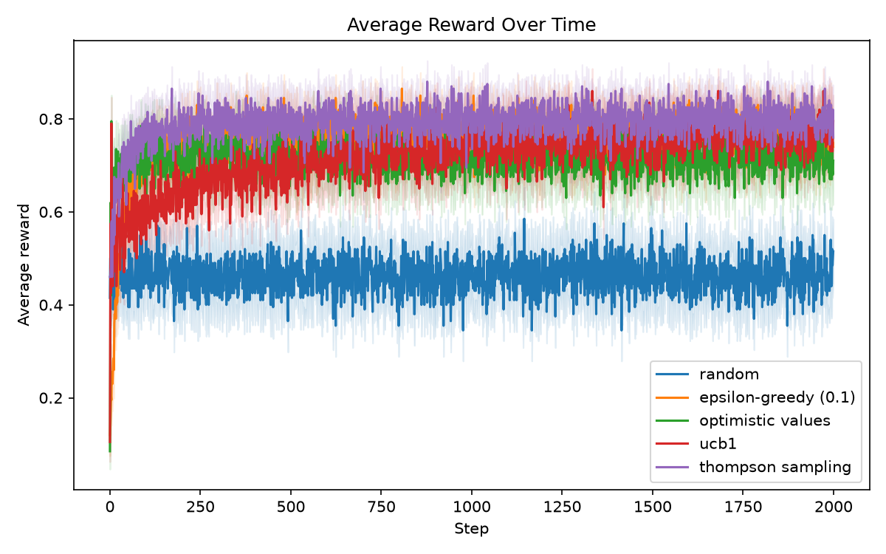

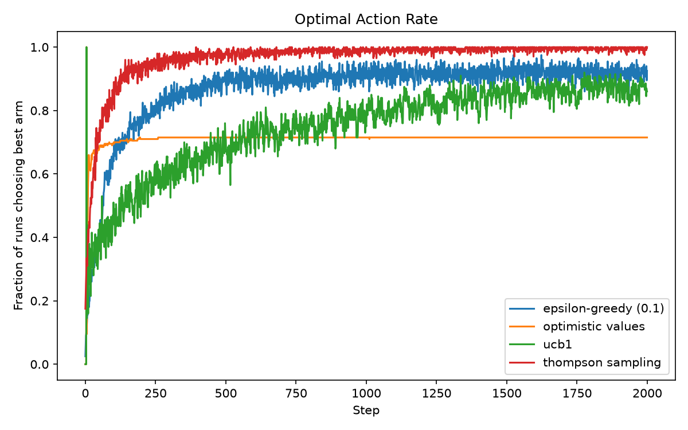

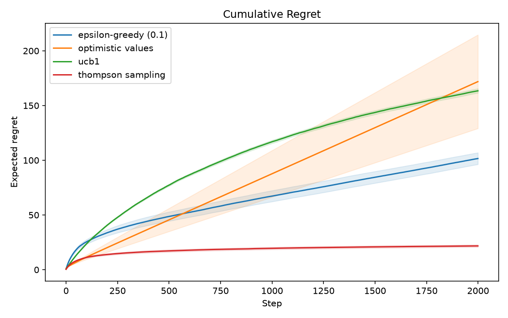

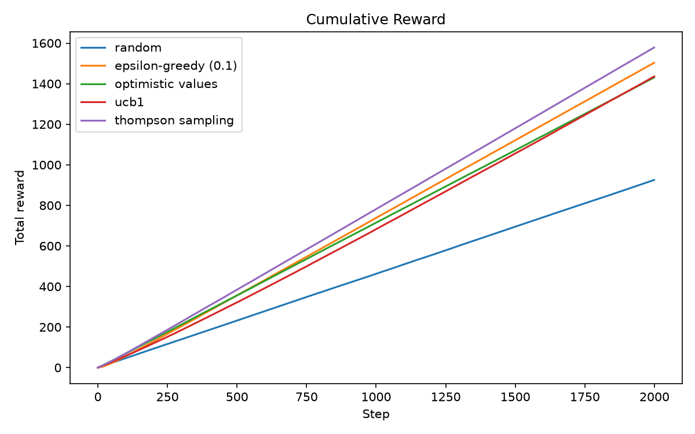

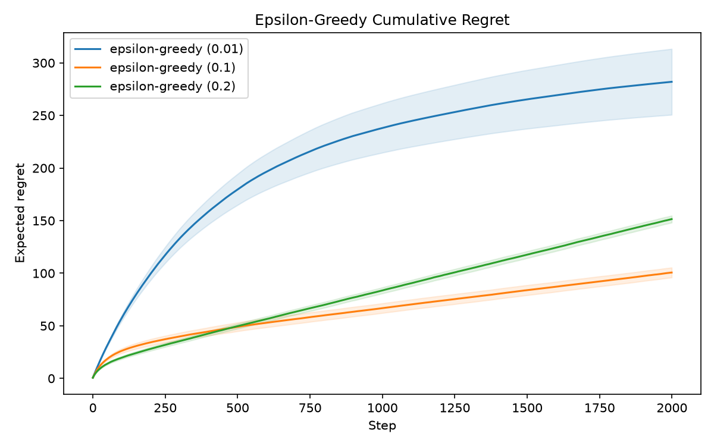

## Running

```bash
python3 -m venv .venv
.venv/bin/python -m pip install -e ".[dev]"
.venv/bin/python scripts/run_bandits.py
.venv/bin/python scripts/check_bandit_results.py
.venv/bin/python scripts/run_tabular_rl.py
.venv/bin/python scripts/check_tabular_results.py
.venv/bin/python scripts/run_dqn.py
.venv/bin/python scripts/check_dqn_results.py
.venv/bin/python scripts/run_policy_gradients.py
.venv/bin/python scripts/check_policy_gradient_results.py
.venv/bin/python scripts/run_ppo.py
.venv/bin/python scripts/check_ppo_results.py
.venv/bin/python scripts/check_all_results.py
.venv/bin/python scripts/summarize_results.py
```

Useful options:

```bash
.venv/bin/python scripts/run_bandits.py --steps 2000 --runs 200 --seed 7
```

## Tests

```bash
.venv/bin/python -m pytest
```

## Notes

Short implementation notes are in [docs/bandits.md](docs/bandits.md).

## Observations

- Thompson Sampling performs best in this setup because it quickly concentrates probability mass on the best arm while still exploring uncertain arms.
- The random baseline confirms that the learning strategies are improving action quality rather than only collecting noisy reward.
- Epsilon-greedy with `epsilon = 0.01` has lower final regret slope but often learns too slowly early on.
- Optimistic initial values are more variable here, which shows up in the wider regret interval.
- Regret is calculated from expected arm rewards, not sampled rewards, so it measures action quality rather than reward noise.

## Tabular RL

The tabular module uses a deterministic Gridworld to compare Q-learning and SARSA.

Q-learning updates toward the best next action:

```text
reward + discount * max_a Q(next_state, a)
```

SARSA updates toward the next action selected by the current policy:

```text
reward + discount * Q(next_state, next_action)
```

Default run:

- 500 episodes
- 50 independent runs
- 50 max steps per episode
- fixed master seed

Results below come from:

```bash
.venv/bin/python scripts/run_tabular_rl.py
```

| Algorithm | Final return | Final success rate | Greedy eval success | Greedy eval steps |
| --- | ---: | ---: | ---: | ---: |
| Q-learning | 0.9434 | 1.0000 | 1.0000 | 6.0000 |
| SARSA | 0.9432 | 1.0000 | 1.0000 | 6.0000 |

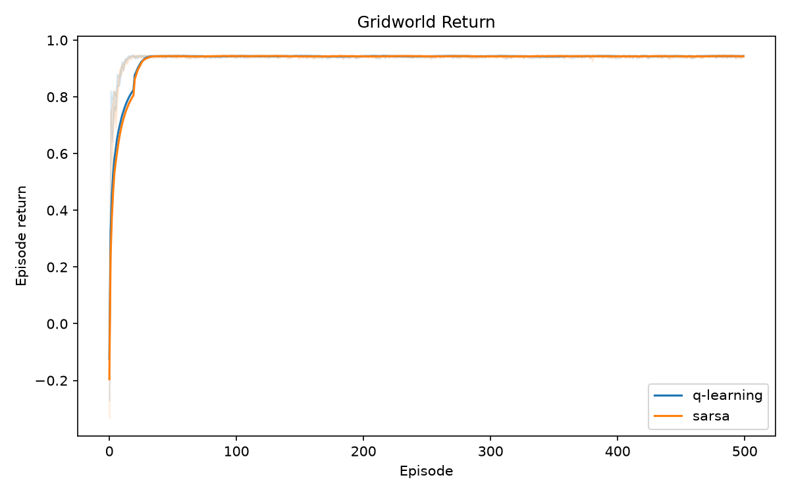

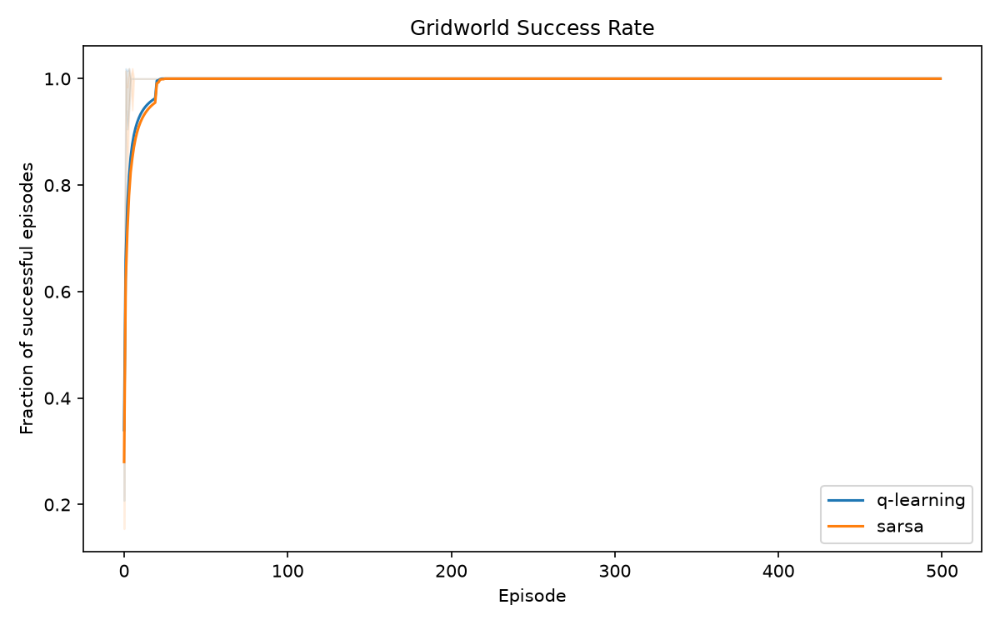

Raw summaries are saved as `results/tabular/summary.json` and `results/tabular/summary.csv`. The Gridworld layout is saved in `results/tabular/gridworld.txt`.

Short implementation notes are in [docs/tabular_rl.md](docs/tabular_rl.md).

## Deep Q-Network

The DQN module trains a small neural Q-network on the same Gridworld. States are one-hot vectors, and the network predicts one Q-value per action.

The implementation includes:

- experience replay
- target network updates
- epsilon-greedy action selection
- Huber loss on bootstrapped Q-targets

Results below come from:

```bash
.venv/bin/python scripts/run_dqn.py
```

| Algorithm | Episodes | Final success rate | Greedy eval success | Greedy eval steps |
| --- | ---: | ---: | ---: | ---: |
| DQN | 300 | 1.0000 | 1.0000 | 6.0000 |

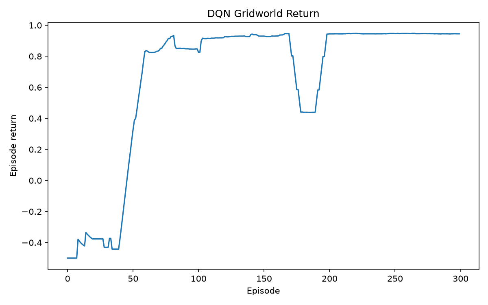

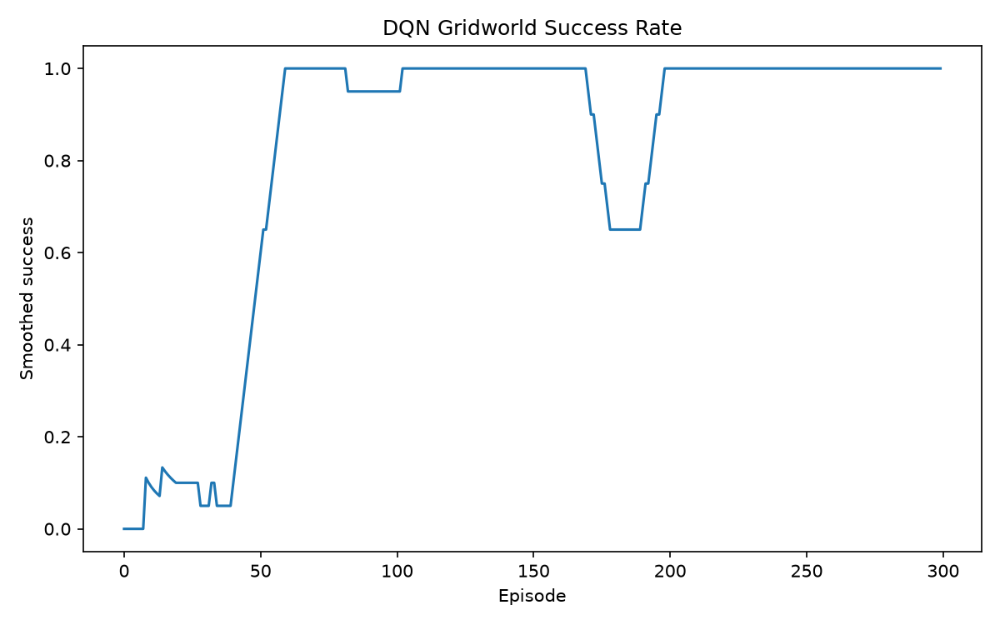

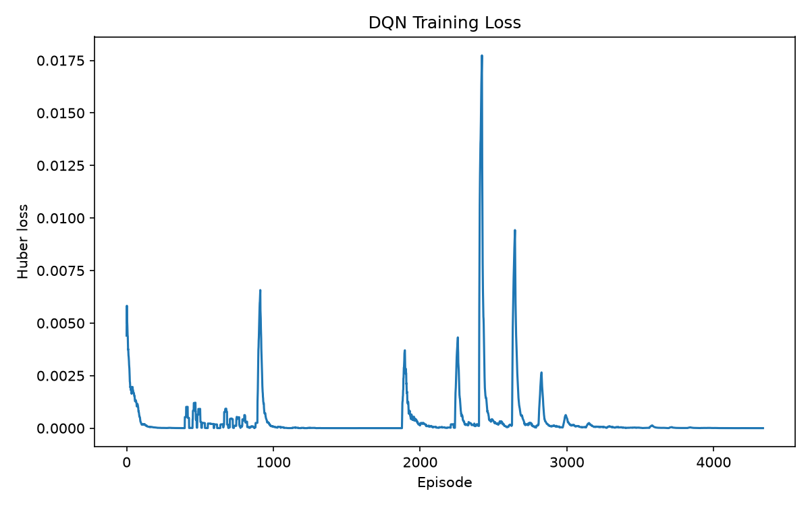

Raw summaries are saved as `results/dqn/summary.json`. The Gridworld layout is saved in `results/dqn/gridworld.txt`.

Short implementation notes are in [docs/dqn.md](docs/dqn.md).

## Policy Gradients

The policy-gradient module trains a small REINFORCE agent on Gridworld. The policy maps one-hot states to action probabilities and updates from complete episode returns.

Results below come from:

```bash
.venv/bin/python scripts/run_policy_gradients.py
```

| Algorithm | Episodes | Final success rate | Greedy eval success | Greedy eval steps |
| --- | ---: | ---: | ---: | ---: |
| REINFORCE | 500 | 1.0000 | 1.0000 | 6.0000 |

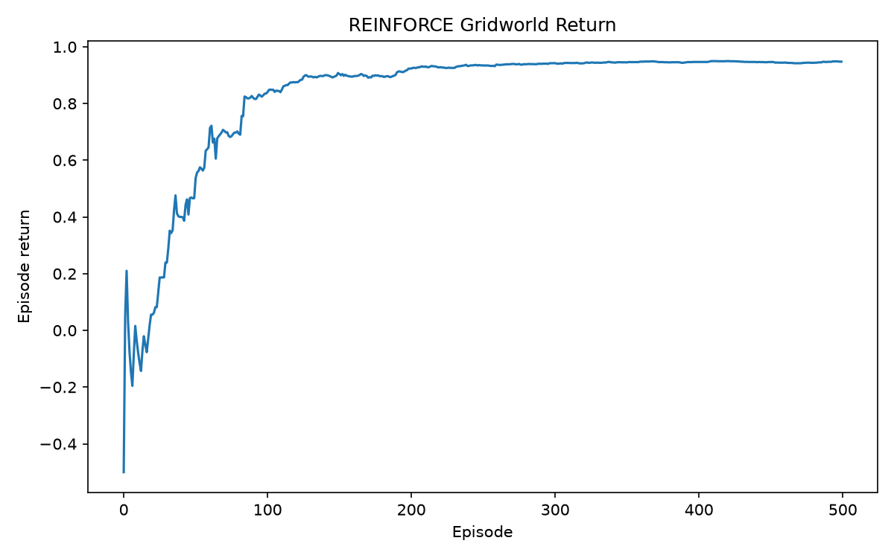

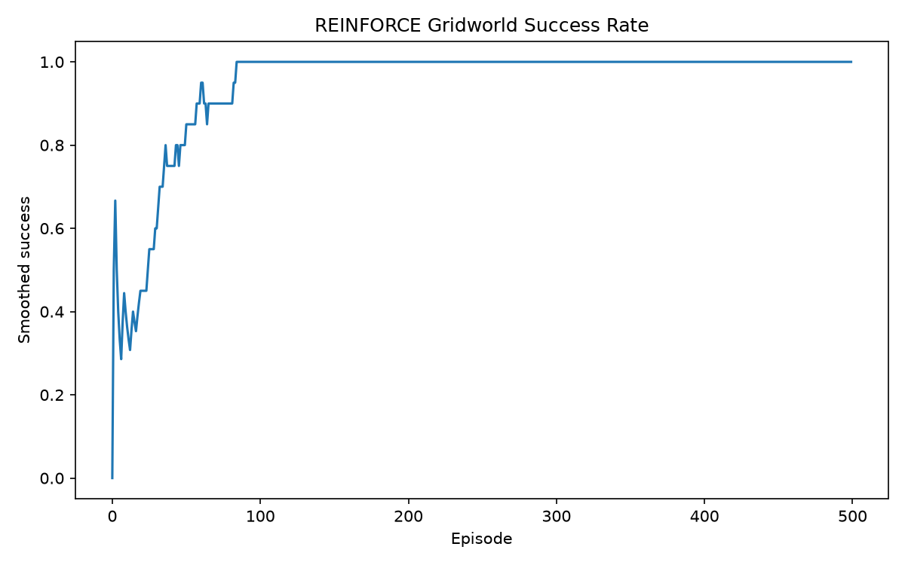

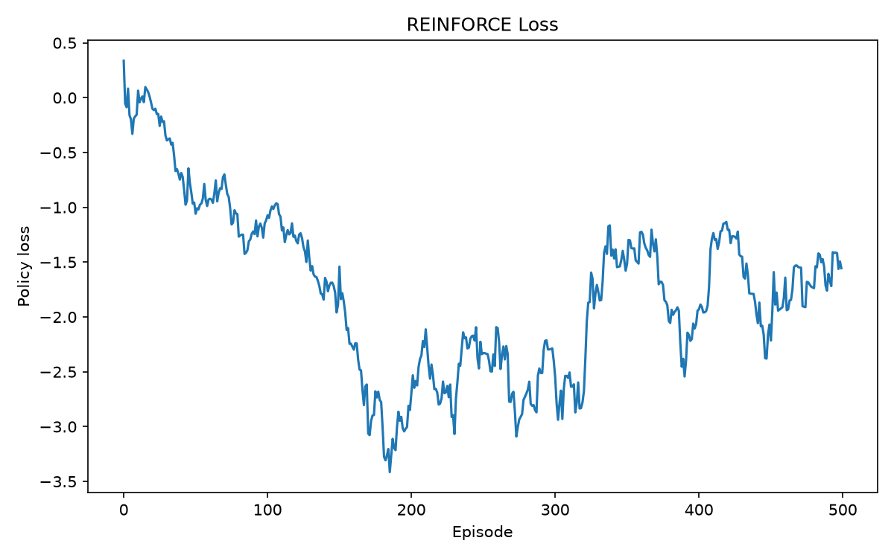

Raw summaries are saved as `results/policy_gradients/summary.json`. The learned action probabilities are saved in `results/policy_gradients/policy.json`.

Short implementation notes are in [docs/policy_gradients.md](docs/policy_gradients.md).

## PPO

The PPO module trains an actor-critic policy on Gridworld. It collects rollouts with the current policy, estimates advantages from discounted returns and value predictions, then applies the clipped PPO objective.

Results below come from:

```bash
.venv/bin/python scripts/run_ppo.py
```

| Algorithm | Updates | Rollout steps | Final success rate | Greedy eval success | Greedy eval steps |
| --- | ---: | ---: | ---: | ---: | ---: |
| PPO | 80 | 128 | 1.0000 | 1.0000 | 6.0000 |

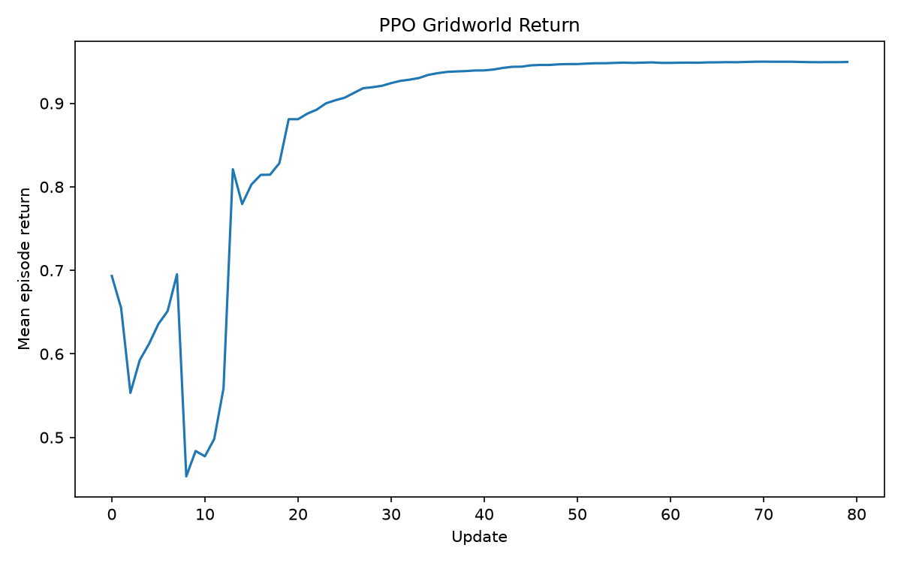

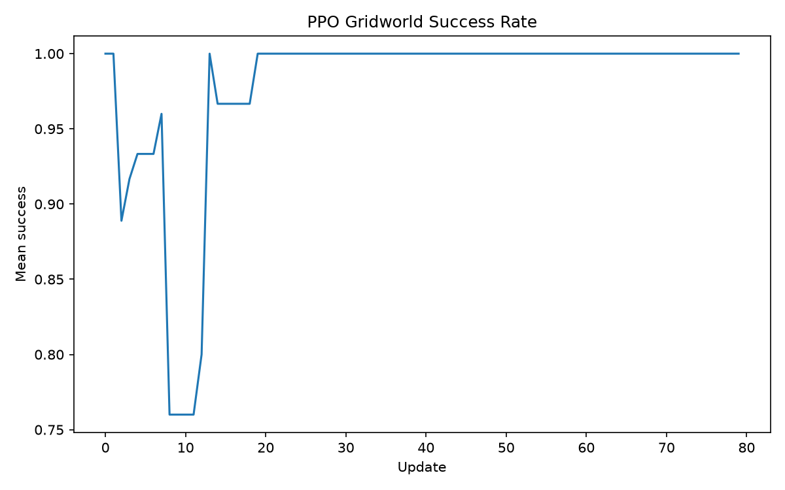

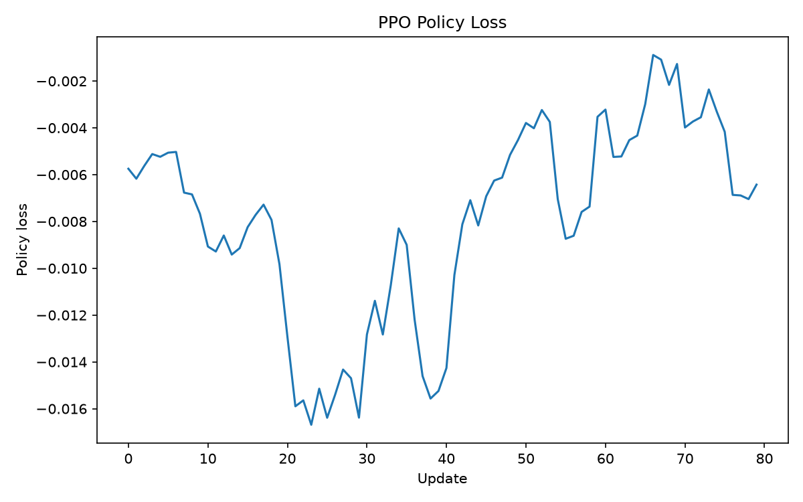

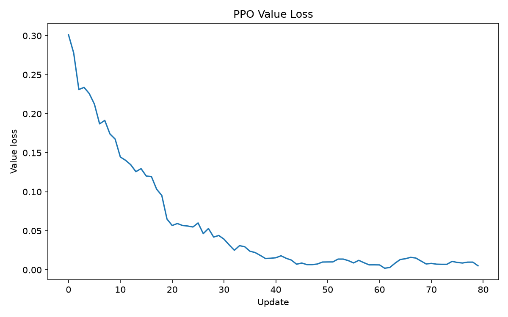

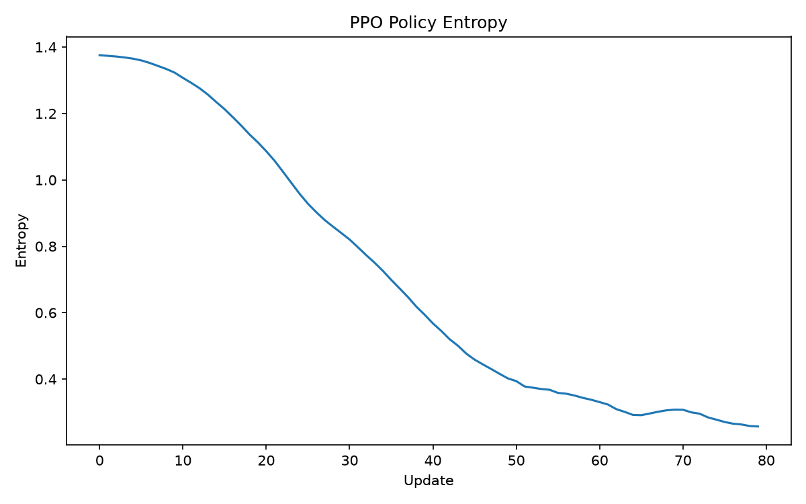

Raw summaries are saved as `results/ppo/summary.json`. The learned action probabilities are saved in `results/ppo/policy.json`.

Short implementation notes are in [docs/ppo.md](docs/ppo.md).

## Next

The next step is a cleanup pass across the RL modules before moving to a larger environment.
